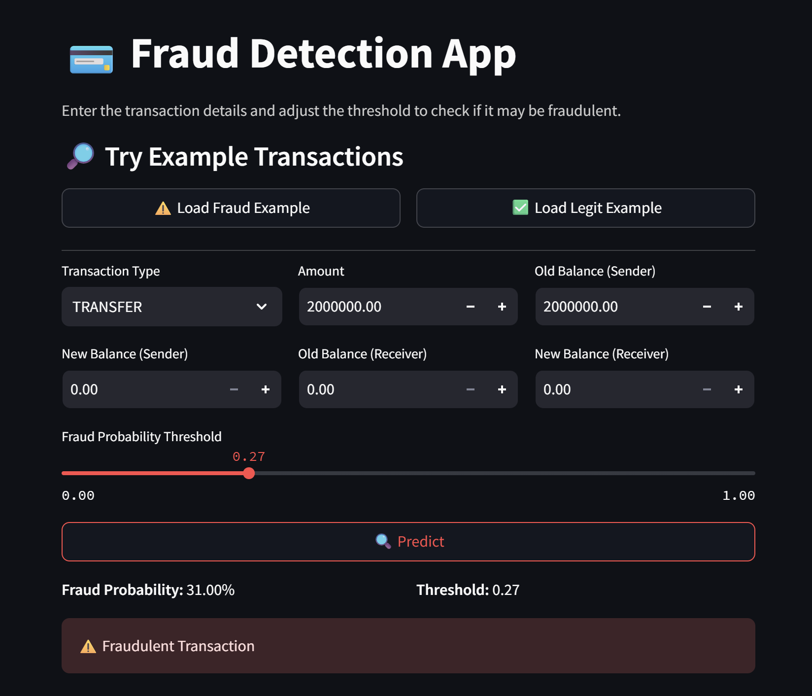

# 💳 High-Performance Financial Fraud Detection System

## 🚀 Live Demo
🔗 **Project URL:**  
https://fraud-model-deploy.onrender.com/

---

## 🖼️ Demo (UI Screenshot)

Below is the preview screenshot of the application UI:



---

## 🎯 Project Goal

The primary objective of this project is to build a **machine learning system** capable of accurately identifying **fraudulent financial transactions** in a highly imbalanced dataset (6.3 million records with only 0.13% fraud).

The final model aims to:
- **Minimize financial loss** → High Recall  
- **Reduce unnecessary alerts** → High Precision  

---

## 📊 Final Performance Metrics

The optimized **Random Forest Pipeline** delivered strong performance on the **1.9 million** record test set:

| Metric | Score | Meaning |
|-------|--------|---------|
| **F1-Score (Fraud)** | **0.8954** | Strong balanced performance |
| **Precision** | **0.8892 (~89%)** | Only 11% false alarms |
| **Recall** | **0.9018 (~90%)** | Captures 90% of actual frauds |
| **PR-AUC** | **0.9631** | Excellent performance on imbalanced data |

---

## 💡 Key Technical Strategies

### 1️⃣ Feature Engineering: Improving Money Flow Detection

Fraud was strongly tied to inconsistencies in account balances.  
Two engineered features significantly boosted model performance:

- `balanceDiffOrig`  
- `balanceDiffDest`

These capture mismatches between expected and actual balances — strong indicators of fraudulent manipulation.

Additional steps:
- Applied `log(x + 1)` to transaction amounts to handle extreme outliers.

---

### 2️⃣ Model Choice: Random Forest over Logistic Regression

- Logistic Regression (baseline):  
  - Precision: **2.26%**  
  - Over **100,000 false positives**  
  - Not suitable for complex fraud patterns.

- **Random Forest Classifier**:  
  - Captures non-linear interactions  
  - Handles imbalance using `class_weight='balanced'`  
  - Produces strong precision–recall tradeoff

---

### 3️⃣ Threshold Optimization: The Biggest Improvement

The default threshold of **0.5** failed for this imbalanced dataset.

**Solution:**
- Switched to probability-based predictions (`predict_proba`)
- Evaluated thresholds from **0.0 → 1.0**
- Found optimal threshold = **0.27**

This threshold:
- Increases precision by converting mid-range probabilities (e.g., 0.40) into fraud signals  
- Maintains high recall  
- Improves overall **F1-score**

---

## 🛠️ System Architecture

### ✔️ Preprocessing with Scikit-learn Pipeline
- `StandardScaler` for numeric columns  
- `OneHotEncoder` for categorical columns  
- Fully automated preprocessing during inference  
- No data leakage

### ✔️ Model Persistence
- Complete pipeline saved as:  
  **`fraud_detection_rf.pkl`** using `joblib`

### ✔️ Deployment
- Frontend: **Streamlit**
- Backend: Pre-trained Random Forest Pipeline  
- Output:
  - Fraud probability  
  - Final decision using threshold = 0.27

---

## ⚙️ How to Run Locally

```bash
# 1️⃣ Install dependencies
pip install pandas scikit-learn numpy joblib streamlit

# 2️⃣ Run the app
streamlit run app.py
